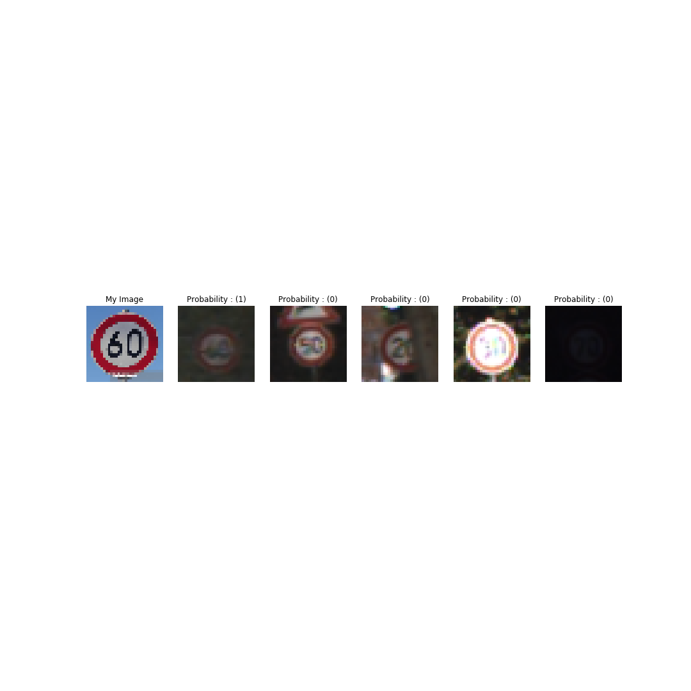
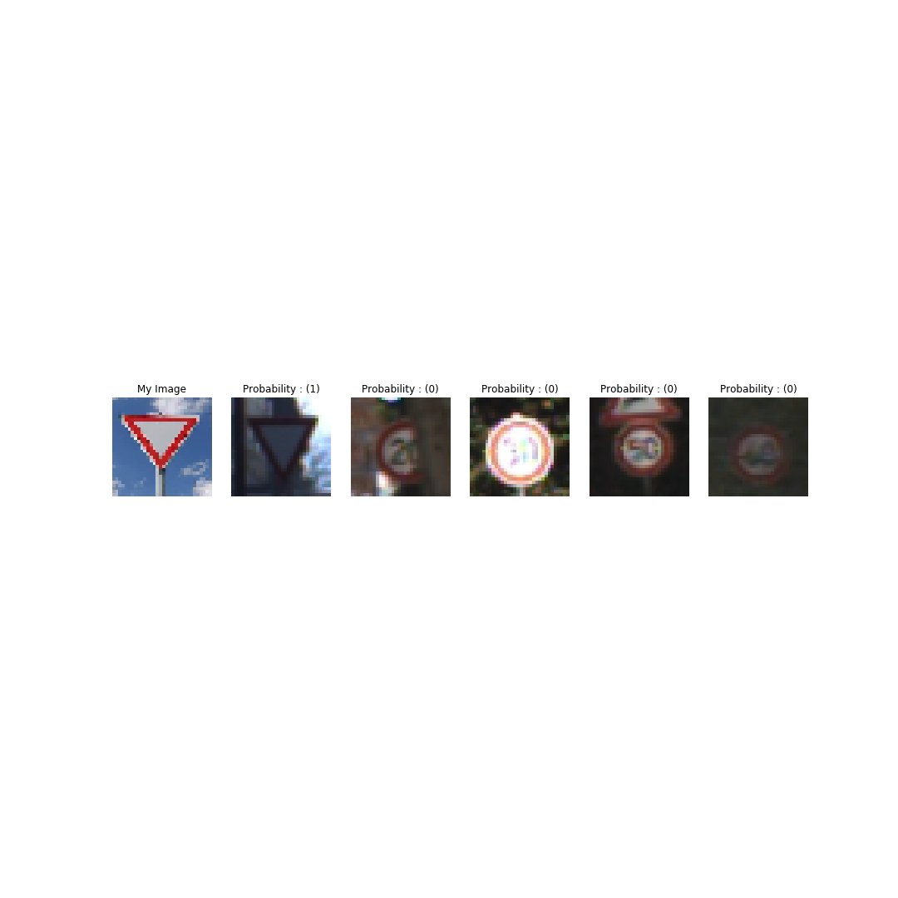

## Project: Build a Traffic Sign Recognition Program

### Dataset Summary: -
#### Data is provided with workspace in data folder. It contains three files train.p, valid.p and test.p for training, validation and testing data respectively. Data is loaded using pickel.

### Exploratory Visualization: - 
#### signames.csv file is provided with workspace that contains text description of each class. signames.csv file is read and there are 43 classes, 12 of them are visualized with text description as title. Below figure also show the same.

#### below plot shows data for each class in training(red), validation(black) and test(green) data set.

### Preprocessing: - 
#### Traffic sign images are in RGB format. But color is not important to classify a traffic sign. So images are converted to gray images. apart from that images are normalized before traffic sign classifier. Normalized input helps in traning to find solution fast.

### Model Architecture: - 
#### Model architecture is highly inspired by LeNet. It has 5 layers.
#### Layer 1: - 
#####     a) Convolution Input size 32X32X1 to output size 28X28X6
#####     b) activation relu
#####     c) pooling input size 28X28X6 to output size 14X14X6

#### Layer 2: - 
#####    a) Convolution Input size 14X14X6 to output size 10X10X16
#####    b) activation relu
#####    c) pooling input size 10X10X16 to output size 5X5X16

#### Layer 3: - 
#####   a) Flaten Input size 5X5X16 to output size 400
#####   b) Normal neural network Input size is 400 to Output size 120
#####   c) activation relu
 
#### Layer 4: - 
#####  a) Normal neural network Input size is 120 to Output size 84
#####  b) activation relu
 
#### Layer 5: - 
##### a) Normal neural network Input size is 84 to Output size is 43
 
### Model Training: - 
#### I used Lenet Architecture with epoch to 500, batch size 64 and learning rate 0.001. AdamOptimizer was used which is better than stochastic gradient descent.

### Solution Approach: -
#### From lectures I started with Lenet architecture which is explained previously. Lenet is for 10 classes but we have 43 classes, so I modified the input features vector size. First I trained with only 10 epoch with learning rate 0.001, with that I was able to get good training accuracy but validation accuracy was not good, apart from that validation accuracy varied with different trainings. This meant that model was overfitting or was trained for few dataset. Since we are using gradient decent which is stochastic in nature, means we are not using the whole dataset for each epoch. To use more information from the data set I increased epoch to 100 and decreased learning rate 0.0001. But that gave even bad results. So decided to keep the learning rate same as 0.001 and kept epoch increased. That gave improved results. In that direction I decided to increase epoch to 500 with batch size 64 and learning rate 0.001. AdamOptimizer is used from tensorflow which is better than stochastic gradient descent.
#### accuracy in validation set was 0.951 and accuracy in test set was 0.9385

### Acquiring New Images: - 
#### Test the model on new images, Five different traffic sign images were downloaded from internet. Those were
#### Class 17 No Entry
#### Class 3 Speed Limit 60
#### Class 14 Stop
#### Class 2 Speed Limit 50
#### Class 13 Yield

### Performance on New Images: - 
#### Model classified all the 5 images with 80% accuracy. This classifiers fails to classify speed limit 50 sign. Because the test image i have used is different shape from what has been used by the classifier. Classifier used hexagonal shapes. I have used round shapes. This is a case of overfitting. To solve this problem we can increase the dataset. Data for all the classes is not uniform, So the model can be biased to classify classes with more data. So we can add data for the classes which have less data.

### Model Certainty - Softmax Probabilities: - 
#### Top five Softmax probabilities are visualized.

#### Below picture show all these five images with their top five softmax probabilities are in next colomns.

